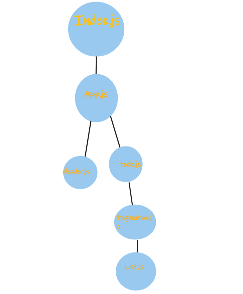

# To Do app :
Description
Creat application allow user enter data in form this data about activity and check if him do that activity or not

the base of todo app.

a user can add a new task
a user can assign that task to name
a user can sort the task by name or by completetion
a user can delete the task -a user is can display only the incompleted tasks

**********

## Uml :

- Netlify link : https://lambent-manatee-f6a697.netlify.app
- repo link : https://github.com/bushraAD98/todo-app
- PR link : https://github.com/bushraAD98/todo-app/pull/1

